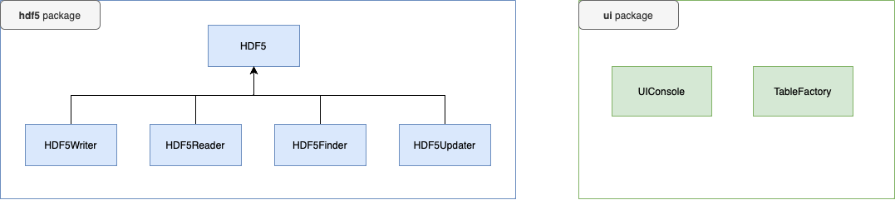

# Dictionary
Console program for storing data in HDF5 files. You can configure all the data you want to store. For each column  
new dataset is created in the HDF5 file with type configured in `settings.py`.

# Commands
- `out` - print all the data.
- `+` - add the row.
- `?` - find the row by the value of the column provided.
- `=` - update the row by id.
- `exit` - exit the program.

# Usage
1. Configure `settings.py` file.
2. Run the `main.py` file.
3. Use allowed commands.

# Architecture

- **hdf5** - contains classes for processing HDF5 files.
  - **HDF5** - for saving filename and columns.
  - **HDF5Writer** - for writing new data in the hdf5 file.
  - **HDF5Reader** - for reading the data from hdf5 file.
  - **HDF5Finder** - for finding the data.
  - **HDF5Updater** - for updating the data by default id column.
- **ui** - contains classes for working with user interface
  - **UIConsole** - for printing data in the console (messages).
  - **TableFactory** - for creating the table and inserting the data.

Moreover, for managing these classes `App` class is used. Default `run()` method should be called for running   
the program. There are private methods for each command in that class.

# Configuration
In `settings.py` you can configure the program.  
You can change these constant variables:
1. `HDF5_FILENAME` contains name of the HDF5 file.
2. `HDF5_DATASETS_DTYPE` contains dtype for data in HDF5. All the data stored as string. Default is **S20**. 
See **h5py** documentation for details.
3. `HDF5_CUSTOM_COLUMNS` contains custom columns.
4. `UI_TABLE_TITLE` contains title of the table for `out` command.
5. `AllowedCommands` contains allowed commands for working with program.

# Packages
- `h5py` - HDF5 files operation.
- `rich` - console utilities.

